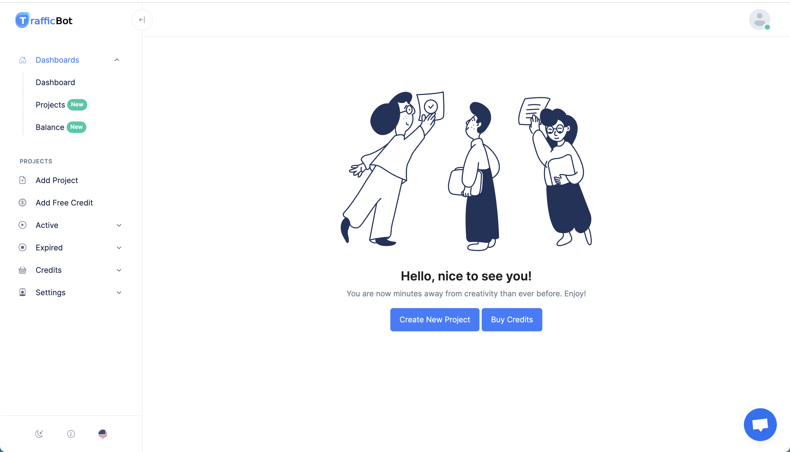
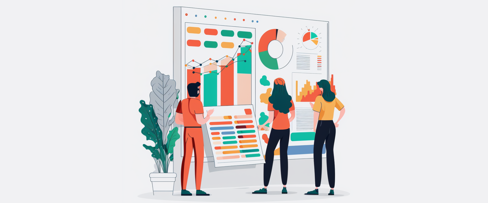

# 10 Common Mistakes to Avoid When Using a Traffic Bot

Martin Freiwald

Sept 29, 2023

10 min read
## Introduction

Maximizing your website traffic is crucial for online success, and
              traffic bots can play a valuable role as a website traffic
              generator. However, to make the most of this tool, it's essential
              to avoid common pitfalls. This article outlines the top 10
              mistakes to steer clear of when using a traffic bot.

[**](javascript:;)
## Over-reliance on Bot Traffic

While a traffic bot can generate website traffic, it's essential
              to balance it with other sources, such as organic search, social
              media, and influencer marketing. Utilizing tools such as[Google Search Console Traffic](./buy-seo-traffic),
              commonly referred to as SEO clicks, can also help increase the
              visibility and credibility of your website.
## Neglecting Website Quality

A well-designed and fast-loading website can positively impact
              your website traffic, regardless of the source. Optimizing for
              both performance and user experience is key to long-term success.
## Not Setting Project Settings

To get the most out of your traffic bot, set specific project
              settings, such as bounce rate, time on page, and returning visitor
              rate. These settings are crucial for ensuring the quality and
              effectiveness of the bot-generated traffic.

Here are some Guides helping you to setup your bot traffic
              correctly:
- [Bounce Rate](/blog/bounce-rate)
- [Geo-Targeting](/blog/geo-targeting)
- [Traffic Speed](/blog/traffic-speed)
- [Device Settings](/blog/device-settings)
- [Organic Traffic](/blog/organic-traffic)
- [Returning Visitor Rate](/blog/returning-visitors)
- [Time On Page](/blog/time-on-each-page)
- [Timezones](/blog/timezones)
- [Navigation Funnels](/blog/navigation-funnels)
- [Social Traffic](/blog/social-traffic)
## Lack of Traffic Quality Monitoring

Regularly monitor the quality of traffic generated by your traffic
              bot, including bounce rate, time on site, and conversion rates.
              Adjust targeting or bot settings if needed.
## Neglecting Bot Testing

Thoroughly test your traffic bot before use to ensure it's working
              correctly and producing desired results. Regularly test settings
              and configurations for optimal performance.

## Refrain from Diversifying Traffic Sources

While a traffic bot can be a valuable tool for generating website
              traffic, it's essential to diversify your traffic sources to avoid
              over-reliance on a single source. Always include[Social Traffic](/blog/social-traffic),[Referral Traffic](/blog/referral-traffic), and[Organic Traffic](/blog/organic-traffic)in your
              projects.
## Setting Unrealistic Goals

Set realistic goals for website traffic and be patient in
              achieving them. Traffic usually increases over time, and it takes
              time and effort to see sustained growth.
## Not Using Google Analytics

Always track your website traffic using Google Analytics. This
              free tool provides valuable insights into website traffic sources,
              user behavior, and conversion rates, among other things. With
              these insights, you can make data-driven decisions to optimize
              your traffic strategy and achieve your goals.In this guide, we'll demonstrate how to[integrate Google Analytics](/blog/enhance-your-website-performance)with our traffic bot.
## Using Bots that Load Ads

Avoid using bots that load ads, as it's against the terms of
              service for most advertising networks and can result in account
              suspension or termination. Instead, focus on bots that contribute
              to genuine engagement and conversions.
## Not Considering the Location and Language of the Traffic

It's essential to consider the[location](/blog/geo-targeting)and[language](/blog/https-language)of your website
              traffic to ensure it's relevant and valuable to your target
              audience. Traffic from countries or regions where your target
              audience is not located may not result in desired outcomes, such
              as conversions or engagement.
## Conclusion

By avoiding common mistakes and optimizing your strategy, you can
              drive high-quality website traffic that is most relevant to your
              target audience. With best practices in place, such as setting
              realistic goals, tracking results with Google Analytics, and
              considering the location and language of your visitors, you can
              achieve tremendous online success with your website traffic
              generator and reach your desired online outcomes.