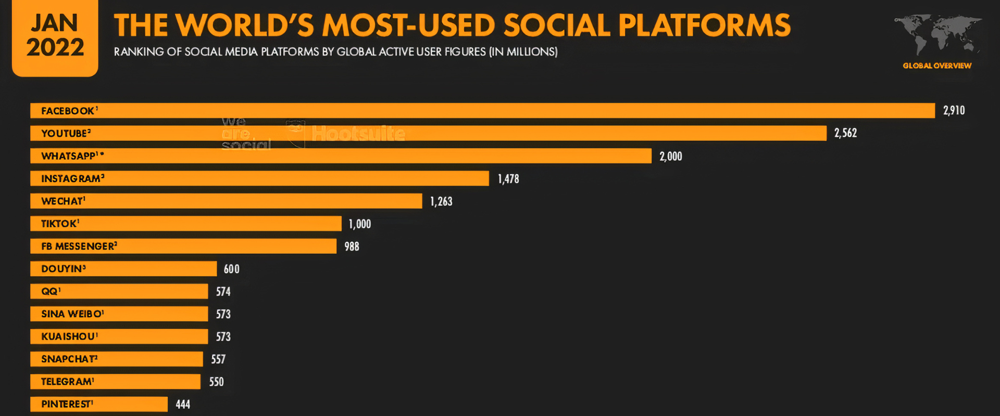
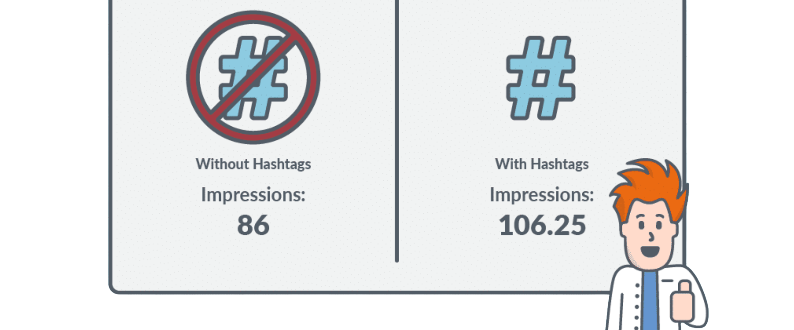

# How to Use Social Media to Drive Traffic to Your Website

Martin Freiwald

Sept 29, 2023

7 min read
## Introduction

Social media can be a powerful tool for driving traffic to your
              website. With over 3 billion active social media users worldwide,
              it’s a platform that you can’t afford to ignore. This article will
              explore strategies for using social media to drive traffic to your
              website.
## Identify Your Target Audience

The first step in using social media to drive traffic to your
              website is to identify your target audience. Who are they? What
              are their interests and pain points? Once you know your audience,
              you can tailor your social media strategy to reach them.
## Choose the Right Social Media Platforms

There are many social media platforms to choose from, each with
              its strengths and weaknesses. It’s essential to choose the
              platforms that are most relevant to your target audience. For
              example, if you’re targeting a younger demographic, you might want
              to focus on TikTok and Instagram. If you’re targeting
              professionals, LinkedIn might be a better fit.

## Create Engaging Content

Once you’ve identified your target audience and chosen the right
              social media platforms, creating engaging content is next. Your
              content should be relevant to your audience and provide value. It
              should also be visually appealing and shareable.
## Use Hashtags

Hashtags are a powerful tool for increasing the reach of your
              social media posts. They make your content discoverable by people
              searching for topics related to your content. Use relevant and
              popular hashtags to increase the visibility of your posts.

## Promote Your Content

Promoting your content is vital in driving traffic to your
              website. You can promote your content through paid advertising,
              influencer marketing, and social media groups. You can also
              cross-promote your content across different social media
              platforms.
## Monitor Your Results

Finally, it’s essential to monitor your results and make
              adjustments as necessary. Use analytics tools to track the
              performance of your social media posts and adjust your strategy
              based on what’s working and what’s not.
## Conclusion

In conclusion, social media can be a powerful tool for driving
              traffic to your website. By identifying your target audience,
              choosing the right social media platforms, creating engaging
              content, using hashtags, promoting your content, and monitoring
              your results, you can use social media to reach a wider audience
              and drive more traffic to your website.