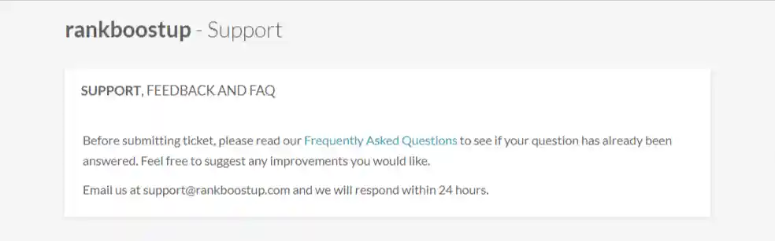

# 

Martin Freiwald

Oct 03, 2023

7 min read
## [#12 Rank Boost Up**](https://rankboostup.com/)

## Introduction

Driving traffic to your website is always a priority. In
                        this review, we will take a closer look at
                        Rankboostup.com. This free website traffic exchange
                        service claims to boost your ranking using its trusted
                        auto-surf traffic exchange. We'll cover their user
                        dashboard, pricing, support, and traffic quality and
                        conclude whether this service is worth your investment.

<iframe width="560" height="315" src="https://www.youtube.com/embed/_hZr_TvIiII" frameborder="0" allowfullscreen></iframe>

## Dashboard

Rankboostup's user dashboard is both functional and
                        visually appealing, featuring a clean design that is
                        easy to navigate. You pay for traffic using "minutes,"
                        and the dashboard allows you to download a Google Chrome
                        extension needed for exchanging traffic. This extension
                        generates "minutes" that you can then use to drive
                        traffic to your website.

## Pricing

Rankboostup offers a flexible pricing model, allowing
                        you to earn "minutes" for free by generating traffic for
                        other users or purchasing a plan that suits your needs.
                        This flexibility makes the service accessible to users
                        with different budgets.

## Support

One potential drawback of Rankboostup is the need for
                        live chat support. They offer email support and claim to
                        respond within 24 hours, but you may be left waiting if
                        you need urgent assistance. For a platform of this size,
                        it would be beneficial to have more accessible customer
                        support.

## Traffic Quality

The traffic quality generated by Rankboostup seems
                        decent, as actual users will be visiting your website.
                        However, there is no control over traffic quality with
                        the free plan, which only allows you to customize the
                        visit duration. You'll need to upgrade to their premium
                        plan to access more targeting options, such as
                        geotargeting and selecting traffic sources.

## Conclusion

Rankboostup offers an accessible and easy-to-use
                        platform for driving traffic to your website. The user
                        dashboard is clean and functional, while the pricing
                        model allows flexibility based on your needs. However,
                        the lack of live chat support and limited traffic
                        quality control may concern some users.

Based on the information available on their website,
                        Rankboostup is a decent option for those looking to
                        increase their website traffic. However, weighing the
                        pros and cons before deciding whether this service is
                        the right choice for you is essential.

If you're looking for a free or low-cost solution,
                        Rankboostup may be worth considering. But suppose you
                        require more hands-on support and greater control over
                        traffic quality and parameters. In that case, you should
                        explore other options.Traffic Types:[Website Traffic](#)[Real Traffic](#)User Dashboard:

Pricing:

Support:

Traffic Quality:

Total Rating:

Links:[Website**](https://rankboostup.com/)[Pricing**](https://rankboostup.com/buy-instagram-likes-and-followers/)