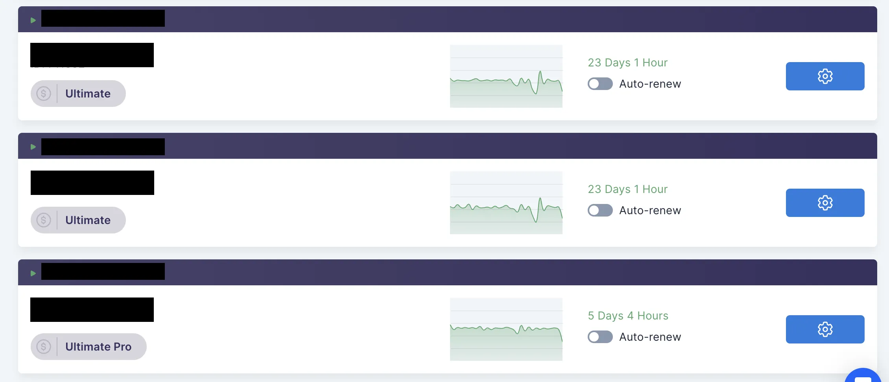

# 

Martin Freiwald

Oct 10, 2023

5 min read

## Introduction

Analyzing our competitors is an essential part of our work to enhance our traffic bot and stay informed. In this comprehensive SparkTraffic review, we will share our insights and firsthand experience with this bot traffic service. Join me as we explore its User Dashboard, Pricing, Support, and Traffic Quality, culminating in my final verdict. Let's jump right in!Sparktraffic holds the prestige of being one of the oldest providers of website traffic in the market. Established in 2008 under the name Trafficbot.uk, Sparktraffic has rebranded in 2019 to Sparktraffic.
## How To Get Free Website Traffic With SparkTraffic

<iframe width="560" height="315" src="https://www.youtube.com/embed/P-J6gY8tTm0" frameborder="0" allowfullscreen></iframe>

## User Dashboard

SparkTraffic has recently reverted to a design to more modern and interactive design. In 2019, they had the best Dashboard. In our SparkTraffic review, we found that although the dashboard interface looked outdated, it was the most functional when managing more than just a few traffic projects. Sparktraffic now has a modern Dashboard, but it still requires much work to ensure compatibility with every browser.

### Favorite Feature Update

The most remarkable improvement is the ability to check the amount of bot traffic delivered in the project overview. Previously it was necessary to go into each project to see the amount of traffic being delivered.This new "small" adjustment allows you to check your traffic statistics with less effort. And if there is an issue with your traffic project, it can be identified much faster than before.
### Project Traffic Overview

## SparkTraffic Pricing

SparkTraffic offers a wide range of SEO services, including Bot Traffic (Economy & Professional Bot Traffic), SEO Traffic (SERP Traffic), Backlinks, and Guest Posting. In this review we will focus on their bot traffic & SEO Traffic (SERP Traffic).In general, sparktraffic offers competitive pricing models. Each traffic plan starts at a low cost to test its service, while larger plans are available and cost far less. In addition, Sparktraffic offers excellent discounts if you purchase their bot traffic in a large amount. As highlighted in this SparkTraffic review, deals start from 20% up to 40% depending on the amount purchased.
### Economy Bot Traffic

The Economy Bot Traffic plans presented by SparkTraffic generate their website traffic with datacenter ips. Datacenter Ips are the lowest quality of ips and can be recognized as spam traffic, and most traffic trackers will filter such website traffic from their statistics. The pricing for their economy traffic plans is very cheap, but it's use is very limited!
## Not Compatible With Google Analytics 4

Additionally, it's essential to be aware that this traffic will not be compatible with Google Analytics 4.It's worth noting that this type of website traffic is primarily used to manipulate traffic statistics and should be recognized as such.

### Professional Bot Traffic

The professional traffic bot plan uses unique residential IPs. Residential Ips are far more expensive. Using residential Ips to generate website traffic is the best option if you are looking for large amounts of website traffic with high quality. Using those ips makes it possible to simulate human website traffic, improving your statistics and search engine rankings.Compared to the economy traffic plan, all professional traffic plans have more features, such as shorteners, UTM campaigns, and more.Most importantly, this website traffic will get tracked by far more traffic trackers, such as Google Analytics 4!
## Compatible With Google Analytics 4

Generating website traffic with residential IPs, which the professional traffic plan uses, is an excellent way to improve your rankings on search engines and statistics.

### SEO Traffic (SERP Traffic)

Sparktraffic provides cost-effective SEO Traffic, also known as SERP Traffic. Sparktraffic has been generating SEO Traffic for two years, which is why their SEO traffic still needs features other traffic bot providers have already implemented. Nevertheless, their SEO traffic is very cheap if you purchase larger amounts. SEO traffic is an ideal solution for businesses that want to improve their search engine rankings on Google through CTR manipulation.
## Supports Google Search Console

Sparktraffic offers six different SEO traffic. The most minor plan starts at $0.39 per click, while the most advanced plan is available at just $0.14 per click.

## Sparktraffic Support

SparkTraffic stands out among other traffic bot services with its exceptional live chat support. The team is highly responsive and provides top-notch assistance. However, it's worth noting that during the nighttime in Europe, their chat support is outsourced to a third-party company with limited expertise beyond the standard FAQ. While they can effectively address basic inquiries, more intricate or challenging questions may require creating a support ticket.SparkTraffic also offers a modest knowledge base to aid users with fundamental queries.

## knowledge Base

SparkTraffic also provides a limited knowledge base to assist users with basic inquiries. However, their knowledge base consists of only 16 articles, which may seem small compared to Traffic-bot.com's offerings.
## Traffic Quality

SparkTraffic delivers excellent traffic quality consistently without bugs or problems across all tested traffic types. The ability to select from different quality options is an incredible advantage as it allows you to obtain the specific type of traffic you require. In this SparkTraffic review, we must emphasize that we strongly recommend opting for SEO traffic for those solely focused on enhancing their ranking. However, we highly approve of their professional service if you aim to strengthen your search engine rankings and overall statistics.It is important to note that we do not recommend utilizing the economy traffic plans, as this type of traffic is generally only suitable for some users.

## Conclusion

In 2023, SparkTraffic significantly improved its dashboard, enhancing user experience. Moreover, its pricing stands out as one of the most affordable options available in the market. Our SparkTraffic review concludes that for those seeking bot traffic, SparkTraffic proves to be an excellent choice.. However, it should be noted that their SEO traffic may lack certain features.While the support system could benefit from some improvements, SparkTraffic provides a reliable and commendable service overall. It ranks #5 out of 30 on our list of recommended traffic bots. If you want to enhance your online presence and drive more traffic to your projects, consider trying SparkTraffic.Traffic Types:[Website Traffic](#)[SERP Traffic](#)[Adult Traffic](#)[Google Search Console Traffic](#)User Dashboard:

Pricing:

Support:

Traffic Quality:

Total Rating:

Links:[Website**](https://www.sparktraffic.com/)[Pricing**](https://www.sparktraffic.com/#pricing)