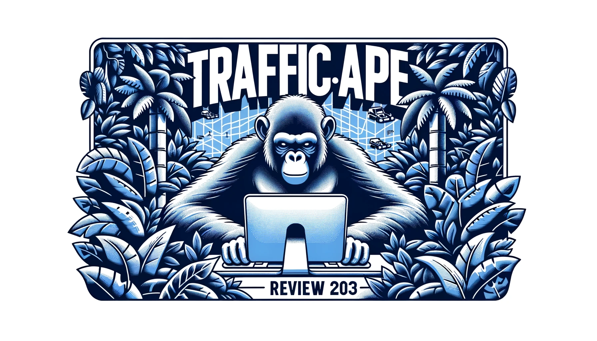
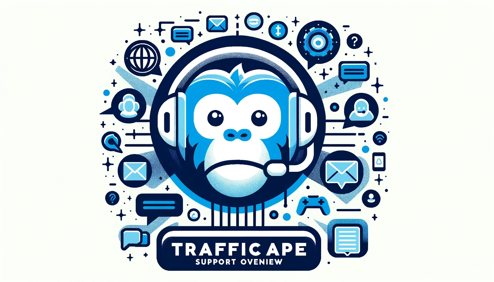

# 

Martin Freiwald

Oct 19, 2023

7 min read
## Introduction

As a seasoned digital marketer with years of experience analyzing and leveraging various traffic generation platforms, I've seen the evolution of tools designed to boost online visibility. TrafficApe stands out as a community-driven traffic generator and ad network, promising to deliver real visitors, page views, and clicks to websites.In this comprehensive Traffic Ape review, drawing from my extensive background in the field and hands-on testing, we will delve deep into TrafficApe's user dashboard, pricing plans, support, and traffic quality. Our goal is to provide an unbiased assessment to help content creators decide if TrafficApe is the right solution to elevate their website traffic.

## Dashboard

When it comes to TrafficApe's user dashboard, the design is purposely kept minimalistic. However, this approach may not sit well with everyone. Some users may get the impression that this website is outdated. It may look like a generic traffic exchange template from Code Canyon.

One area where TrafficApe's platform falls short is the lack of customization options for managing website traffic. There are no features available for controlling essential metrics such as bounce rate, returning visitor rate, or geolocation. This can be a significant disadvantage for users who require more advanced features and data analysis.

The simplicity of the dashboard may appeal to those new to website traffic generators. However, it is limiting for those who need more advanced options. Suppose you're looking for a platform that offers greater control over your website traffic. In that case, consider other options that provide more robust features and customization.

## Pricing

The Awesome plan, available at no cost, grants you 25 daily page views and the ability to add up to 5 unique URLs. Sounds great, right? But wait, there's more!

The Super Awesome plan takes things to a whole new level. Priced at a budget-friendly $29.99 per year or just $3.99 per month, this plan delivers a whopping 100 daily page views, 15 URLs, an ad-free experience, and even more views per session.

TrafficApe's Awesome and Super Awesome plans offer exceptional value for content creators seeking to enhance their online presence. From the free website traffic plan to the feature-packed Super Awesome plan, there's a perfect option for everyone. Don't miss out – join the TrafficApe community today and give your content the exposure it deserves!

## TrafficApe Support Overview

One area where TrafficApe could step up its game is in providing more robust customer support options. Currently, the platform only features an FAQ page to address users' queries and concerns. Though helpful to some extent, it is not the most comprehensive solution for users seeking immediate assistance or encountering complex issues.

Sure, you can submit a support ticket, but let's be honest – it's not quite as efficient or convenient as having access to live chat or email support. When it comes to customer satisfaction, timely and effective communication can make all the difference!

Unfortunately, TrafficApe's shortcomings in the support department are reflected in their ratings on trustpilot.com. The platform appears to be lagging behind its competitors, with less-than-stellar reviews and a reputation for unresponsive customer support.

In conclusion, TrafficApe has room for improvement when it comes to providing top-notch customer support. Expanding their resources to include live chat or email options to their website would greatly enhance the user experience. By addressing these concerns, TrafficApe can take a big step toward building trust and loyalty among its user base.

## Refund Policy

It's important to note that any fees associated with our premium services are non-refundable. They don't offer a satisfaction guarantee, conversion guarantee, or money back guarantee. Therefore, it's crucial to ensure that you're satisfied with the service before making any payment.

Once you spend your money on our services, there's no option to get a refund if you're not satisfied. So, we recommend that you carefully consider your options and ask any questions you may have before making a payment.
## Traffic Quality

TrafficApe boasts of providing genuine visitors and page views to your website, which is music to content creators' ears everywhere.Is it possible to have complete control over the quality of traffic that comes your way? Unfortunately, TrafficApe doesn't provide you with that luxury.

As of now, it's still a mystery whether the platform can weed out visits from those sneaky users who employ VPNs or proxies.

However, the inability to control traffic quality can be a real thorn in the side for those who are hell-bent on optimizing their website performance.

To sum it up, TrafficApe does offer real visitors and page views, which is a significant advantage for content creators. However, the platform's inability to control or verify traffic quality leaves a lingering question. While it may deliver organic traffic, the lack of control over traffic quality should concern users who prioritize optimizing their website performance.

TrafficApe claims to offer real visitors and page views to your website, which is a plus point for content creators. However, there is no way to control or verify the quality of the traffic you receive. It is still being determined whether the platform can filter out visits from users who employ VPNs or proxies. While TrafficApe may deliver organic traffic, the lack of control over traffic quality could be a concern for users who want to optimize their website performance.

## Ad Network

Traffic Ape offers its users an exclusive advertising network to boost their income. By simply integrating their code into your website, you'll start earning from clicks and impressions on the ads displayed. But it's important to note that you won't have control over the content showcased on these banners.

This option shines for websites that haven't yet implemented Google AdSense. However, if you've already got AdSense up and running, Traffic Ape's feature may not add much value to your site. So, weigh your options carefully before diving in.

Curious about what Traffic Ape's ads might look like on your site? Take a gander at the sample ads we've included below to get a feel for their aesthetic.

In conclusion, Traffic Ape offers an alternative ad network for website owners seeking additional revenue streams. While it's an excellent option for those without AdSense, those who have already implemented Google's ad service might not find it as beneficial. Consider your site's needs carefully and weigh the pros and cons before integrating any ad network into your online space.
#### Ad Network Instalation Guide

- 1. Copy & Paste Script In header Or Footer:

To integrate our ad system into your website, copy and paste the script below to either your website header or footer. This script contains your private key and should not be shared with anyone else.
- 2. Choose Ad Size:

Choose the ad size(s) that suit your website best. You can select one or both of the available sizes, and it's fine to display different sizes of ads on your own site compared to other sites. You may place up to two ads per page, but no more than two.
- 3. Copy & Paste HTML Code

Paste the HTML element provided below into the location on your page where you want the ad to be displayed. It's important that the ad placement is visible and in view in order for the ad to be counted towards your ad revenue. For example, placing an ad at the bottom of a page means that it will be displayed and counted only when the user scrolls to the bottom. Avoid using more than two ad divs per page, as this may prevent the ads from being displayed.
##### Sample Ads

###### Rectangle Ad 300x250

###### Banner Ad 728x90

In the event that no ads are displayed above, it may be due to either a lack of users or the ad network being offline, and therefore unable to provide any ads.
### Traffic Ape Video Review

<iframe width="560" height="315" src="https://www.youtube.com/embed/AmSRHxcfwHg" frameborder="0" allowfullscreen></iframe>

## Pros and Cons of TrafficApe

### Pros

- ****Community-Driven Traffic Generation**TrafficApe operates on a community-driven model, ensuring real visitors and page views.
### Cons

- ****Support Issues**Multiple users have reported that TrafficApe rarely responds to inquiries to their support department.
- ****Diverse Offerings**TrafficApe offers both a website traffic generator and an Ad Network service, catering to different needs.
- ****Traffic Discrepancies**Some users have noticed that they receive less traffic than they give, indicating possible discrepancies in traffic exchange.
- ****Affordable Ad Network**The TrafficApe Ad Network is cost-effective, charging only $1.00 for every 1,000 ads viewed.
- ****Google Analytics Concern**Google Analytics does not support TrafficApe, which can be a concern for those relying on Google's tools.
- ****User-Friendly**The platform is designed to be simple and straightforward, allowing users to easily add their URLs and automate traffic views.
- ****Subscription Confusion**Users were asked to pay for subscriptions they had already purchased, leading to trust issues.
## Conclusion

Are you an active blogger or social media enthusiast looking for an affordable and straightforward traffic generator? If so, you might consider TrafficApe. This platform's community-driven approach ensures you receive real traffic at a low cost.

However, if you're looking for more control over traffic quality, TrafficApe may not be the best option for you. The limited support options can also be a significant drawback, particularly if you encounter any issues.

On the other hand, if you value simplicity and affordability over customization and traffic control, TrafficApe might be a suitable option. It can help you increase your website's traffic without breaking the bank.

It's important to note that TrafficApe's lack of customer support can be a big problem, particularly if you're spending a considerable amount of money. If you require more advanced features and better support, it might be worth exploring alternative traffic generator platforms.

In conclusion, TrafficApe can be an excellent choice for those who want a straightforward and cost-effective way to generate website traffic. However, it's important to consider the platform's limitations and potential drawbacks before making a decision.

Thank you for reading our traffic Ape review. If this Traffic Ape review helped you, please share it and help others. If you want us to write a review about your website, please email us at support@traffic-bot.com.Traffic Types:[Website Traffic](#)[Real Traffic](#)User Dashboard:

Pricing:

Support:

Traffic Quality:

Total Rating:

Links:[Website**](https://www.trafficape.com/)