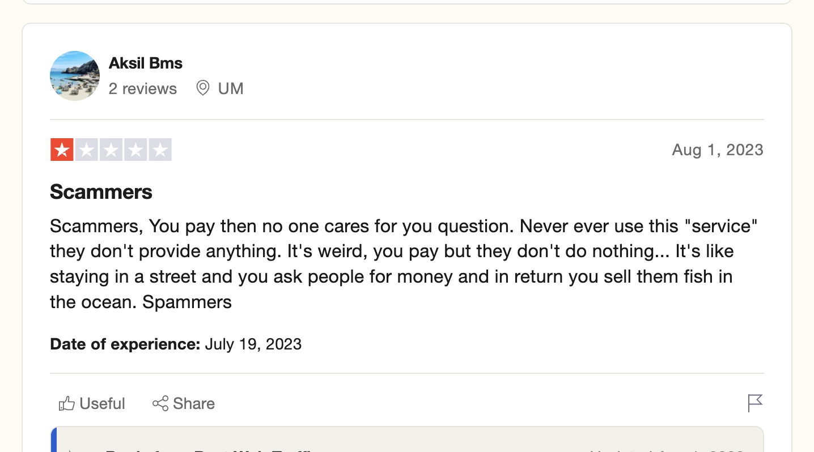
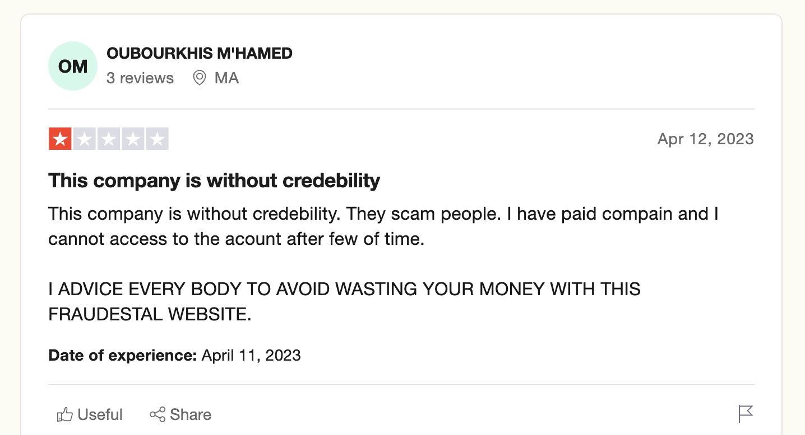
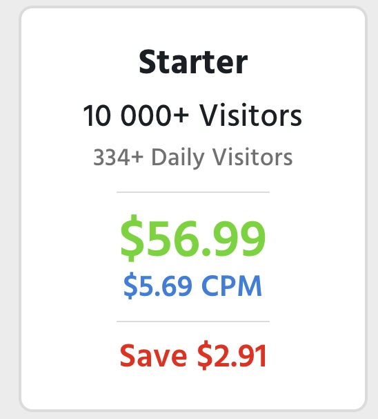
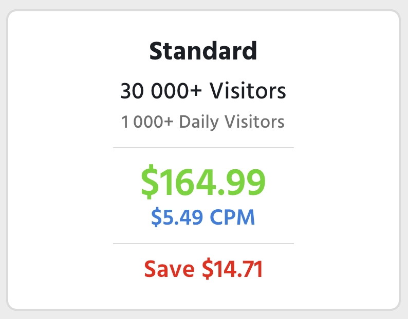
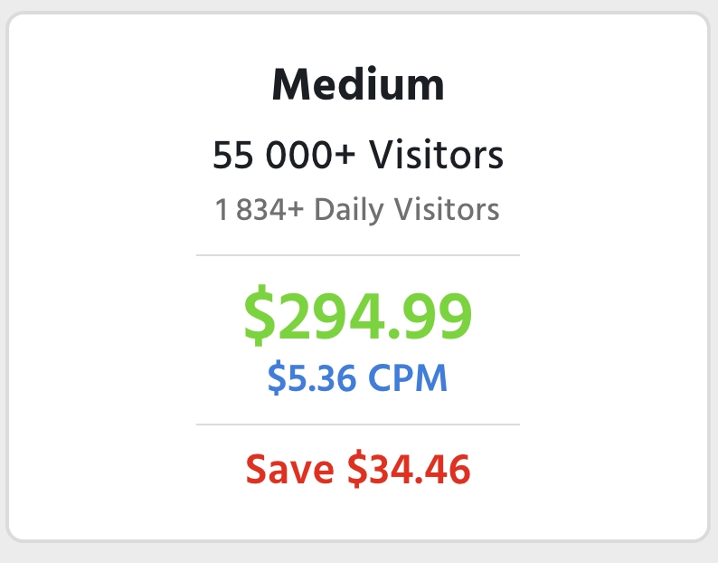

Traffic Bot Review
# Best Web Traffic Review 2023: Details, Pricing, Features

## Introduction

In the ever-evolving digital marketing landscape, web traffic remains a crucial metric for success. But not all traffic is created equal. Today, we delve into an in-depth review of BestWeb-Traffic.com, a service that promises to deliver targeted human traffic to your website. We'll examine its features, benefits, and some red flags, all while focusing on how it can fit into your SEO strategy.
## What is BestWeb-Traffic.com?

BestWeb-Traffic.com is a service that offers various traffic plans, commonly referred to as campaigns. These campaigns promise to deliver targeted 'smart delivery' human traffic to your website. The service allows you to choose the duration of your campaign, ranging from 7 to 30 days and even offers 24/7 customer support.
- Smart Delivery
- 7-30 Day Campaign
- AdSense Safe
- US, UK, CA & 150+ Countries
- Real Targeted People
- 24/7 Support
## Features and Benefits

One of the standout features of BestWeb-Traffic.com is its extensive range of geolocations and affinity audiences (niches) to choose from. This allows for highly targeted campaigns that can be more effective in driving conversions.

The platform claims to offer Adsense-safe, bot-free, and junk-free traffic. You can opt for automatic smart targeting or manually input your chosen niches. The service also allows you to pick your goals—whether you want more traffic or more conversions.
- Pop Ads & Full Page Interstitials
- Boost Traffic & Conversions
- Best Performing Formats
- Real Targeted People
- 100% Safe & Trackable
- High-Quality Traffic
- Automatic Targeting
- Smart Goals
- Smart Delivery
- No Bot & Junk Traffic
- US, UK, CA & 150+ Countries
- 24/7 Approval & Monitoring
- 30-Day Money Back Guarantee
### Flexibility

The service offers the flexibility to cancel, pause, or retarget your campaigns at any time. This is particularly useful for businesses that need to adapt their strategies quickly.
### Money-Back Guarantee

BestWeb-Traffic.com offers a full money-back guarantee, providing an extra layer of security for those skeptical about the effectiveness of their service.
## The Power of Audience Selection: Over 300 Choices

From niches in technology, fashion, and healthcare to specific interests like veganism, outdoor activities, or cryptocurrency, the platform covers an extensive range of audience types. This allows businesses to not just target users based on geographical location but also based on specific interests, behaviors, and even purchasing intent.
### All Available Audiences:

- Shopping
- Electronics
- Clothing
- Shoes
- Toys
- Furniture
- Luxury
- Gifts
- Coupons
- Fashion
- Women
- Men
- Children
- Apparel
- Accessories
- Handbags
- Jewelry
- Watches
- Beauty
- Beauty Salons
- Beauty Products
- Hair
- Makeup
- Personal Care
- Cosmetics
- Perfume
- Natural
- Tattoos
- Fitness
- Gym
- Gym Equipment
- Workout Supplements
- Recreation
- Travel
- Vacation and Tourism
- Recreation Leisure
- Wellness
- Citybreaks
- Camping
- Nature
- Airline
- Cruise
- Hotels
- Guest Houses
- Food and Drinks
- Cooking
- Baking
- Recipes
- Drinks
- Alcohol
- Beverages
- Wine
- Beer
- Restaurants
- Fast Food
- Organic Food
- Vegetarian
- Continental Gastronomy
- Diet
- Instructional Diet
- Diet and Exercise
- Dietary Supplements
- Health
- Men Health
- Women Health
- Healthy Lifestyle
- Eye Care
- Skin Care
- Energy
- Vitamins
- CBD
- Family
- Wedding
- Babies Expectant
- Babies
- Kids
- Teens
- Kids Activities
- Animals
- Dogs
- Cats
- Horses
- Birds
- Fish
- Rabbits
- Reptiles
- Landscape
- Smart Home
- Home Security
- DIY
- Automotive
- Cars
- Trucks
- Vans and RVs
- Motorcycles
- ATV
- Boats
- Fuel
- Parts
- Car Rentals
- Hobbies and Activities
- Arts and Crafts
- Photography
- Fishing
- Gardening
- Martial Arts
- Surfing
- Running
- Acting
- Dancing
- Singing
- Writing
- Performing
- Entertainment
- Streaming
- TV
- Cinema
- Movies
- Music
- Books
- Ebooks
- Comics
- Magazines
- Literary
- Anime
- Humor
- Science Fiction
- News and Information
- Current and World
- Business News
- Entertainment News
- Technology News
- Sport News
- History
- Astrology
- Sports
- Baseball
- Basketball
- Football
- Soccer
- Hockey
- Wrestling
- Golf
- Racing
- Winter Sports
- Summer Sports
- Sporting Goods
- Sport Tickets
- Games
- Online Games
- PC Games
- Console Games
- Mobile Games
- Card Games
- Society
- Politics
- Culture
- Religion
- Charity
- Exhibitions
- Communities
- Social Services
- Miscellaneous
- Education
- Higher Education
- High School
- School
- Students
- Online Education
- Business
- Home Business
- Online Business
- Money Making
- Passive Income
- Opportunities
- Animal Accessories
- Animals Training
- Home and Garden
- Home Appliances
- Interior Decoration
- Furnishing
- Renovation
- Property Management
- Property Rentals
- Bills
- Tax
- Electricity
- Agriculture
- Farmers
- Plants
- Machinery
- Science
- Ecology
- Astronomy
- Solar Energy
- Medical
- Medical Services
- Medical Equipment
- Pharmacy
- Dentistry
- Seniors
- Computers
- Desktop and Laptops
- IT Support
- Computer Viruses
- Computer Advice
- Computer Related
- Computer Components
- Computer Peripherals
- Programming
- Data
- Software
- Hardware
- Phones
- Smartphones
- iPhones
- Tablets
- Mobile Apps
- Cellular Services
- Internet
- Web Design
- Web Development
- Web Hosting
- Domain Names
- Blogs
- Ecommerce
- Dating
- Internet Marketing
- Internet Advertising
- Internet Security
- Internet Services
- Social Media
- Forums
- SEO
- Email
- Links
- Surveys
- Affiliate Marketing
- Lead Generation
- WordPress
- Technology
- Internet Networks
- Telecommunications
- High Tech
- Finance
- Investing
- Banks
- Student Banks
- Assets
- Gold
- Silver
- Cryptocurrency
- Forex Trading
- Stock Exchange
- Credit Cards
- Credit Repair
- Debt Relief
- Debt Consolidation
- Retirement
- Insurance
- Life Insurance
- Banking Insurance
- Travel Insurance
- Insurance Services
- Loans
- Mortgage
- Wild Animals
- Pet Food
- Advertising
- Construction
- Engineering
- Real Estate
- Retail
- Auctions
- Careers and Employment
- Job Search
- Property
- Commercial Property
- Residential Property
- Personal Loans
- Payday Loans
- Business Loans
- Veterans Loans
- Car Loans
- Car Lease
- Loan Modification
- Refinance
- Design
- Graphic Design
- Fashion Design
- Interior Design
- Art
- Digital Art
- Fine Art
- Antiques
- Collectibles
- Refinance
- Design
- Graphic Design
- Fashion Design
- Interior Design
- Art
- Digital Art
- Fine Art
- Antiques
- Collectibles
- Crafts
- Clipart
- Paintings
- Firearms
- Guns
- Ammo
- Gun Parts
- Smoking
- E-Cigarettes
- Vape
- Cigarettes
- Cigars
- Pipes
- Tobacco
- Gambling
- Casino
- Lottery
- Bets
- Poker
- Slots
- Adult
- Live Webcams
- Adult Videos
- Adult Dating
- Adult Paysites
- Adult Toys
- Adult Games
- Enhancements
- MLM
- Management
- Sales
- Legal Services
- Marketing
- Advertising
- Construction
- Engineering
- Real Estate
- Retail
- Auctions
- Careers and Employment
- Job Search
- Property
- Commercial Property
- Residential Property
## Red Flags and Concerns

### Mixed Reviews

While the service comes highly recommended on their own platform, external reviews tell a different story. Trustpilot and Webmaster Reviews have several users claiming that the service is a scam, with some even stating that they received no traffic at all.
### Questionable Traffic Quality

Some users have reported receiving traffic from sketchy URLs, with high bounce rates and zero time spent on the website. This could potentially harm your SEO efforts rather than help them.
### Customer Support Issues

Despite the 24/7 customer support claim, some users have reported poor customer service experiences, including unresponsive support and account suspensions without clear reasons.
### Trustpilot Reviews

- [Overall Rating](#review-5)
- [Review 1](#review-2)
- [Review 2](#review-3)
- [Review 3](#review-4)
- [Review 4](#review-6)

[All Trustpilot Reviews](https://www.trustpilot.com/review/bestweb-traffic.com)
### Pricing & Traffic Plans

BestWeb-Traffic.com offers a variety of pricing plans to suit different needs and budgets. Whether you're a small business looking for a quick traffic boost or an enterprise in need of a large-scale campaign, there's likely a plan for you.
#### All Traffic Plans:

- [Small](#small)
- [Starter](#starter)
- [Basic](#basic)
- [Standard](#standard)
- [Medium](#medium)
- [Extra](#extra)
- [Premium](#premium)

## How Does BestWeb-Traffic.com Fit Into Your SEO Strategy?

### The Good

If the service delivers as promised, the targeted human traffic could potentially improve your website's SEO rankings. The ability to target specific geolocations and niches can also be a boon for localized SEO strategies.
### The Bad

On the flip side, if the traffic quality is as poor as some reviews suggest, it could negatively impact your SEO. High bounce rates and low session durations are red flags for search engines and could result in a lower ranking.
## Practical Examples and Call to Action

### Using Traffic Bots Tools for SEO

If you're skeptical about services like BestWeb-Traffic.com, Traffic Bots offers a range of tools that can help you analyze and improve your web traffic for SEO purposes. These tools are designed to provide actionable insights that can guide your digital marketing strategy.
### Final Thoughts and Next Steps

Given the mixed reviews and potential red flags, it's crucial to approach BestWeb-Traffic.com with caution. If you decide to try it, start with a smaller, less expensive campaign to gauge its effectiveness. Always monitor the quality of the traffic you receive and be prepared to adjust your strategy accordingly.
## Conclusion

In the world of digital marketing, where web traffic is gold, it's essential to do your due diligence before investing in any service. BestWeb-Traffic.com offers some promising features but also comes with its share of concerns. As always, the key to successful SEO is continuous learning and adaptation. So, whether you're new to the game or a seasoned pro, keep testing, keep analyzing, and keep optimizing.Traffic Types:[Website Traffic](#)[Bot Traffic](#)[Targeted Traffic](#)User Dashboard:

Pricing:

Support:

Traffic Quality:

Total Rating:

Links:[Website**](https://www.bestweb-traffic.com)