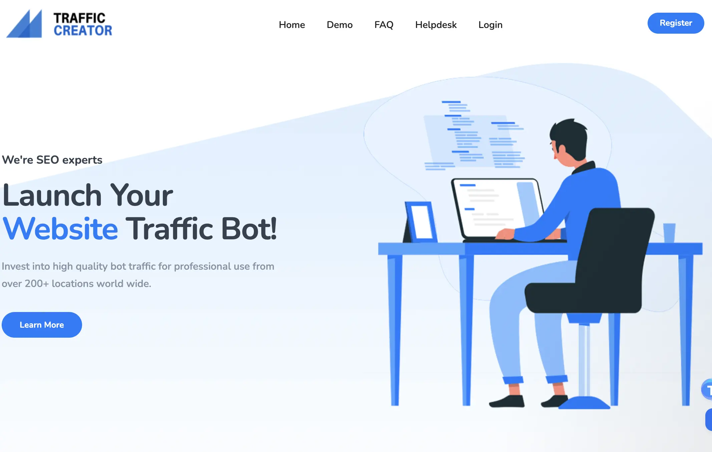

# 

Martin Freiwald

Oct 23, 2023

6 min read
## Introduction

Have you ever considered how to buy SEO traffic to boost your website's visibility? While some sites naturally draw vast amounts of visitors, others seem to linger in the shadows. This was a challenge I faced early in my digital journey. However, everything pivoted when I embraced purchasing quality SEO traffic. It amplified my online presence and underscored the transformative power of making suitable digital investments.
## What is SEO Traffic?

Now, before we dive in, let's make sure we're all on the same page. SEO traffic refers to the visitors who land on your website through unpaid search engine results, otherwise known as organic results. However, you can also 'buy' SEO traffic to**give your site that much-needed visibility boost.**

The great thing about SEO traffic is that it's completely trackable in Google Search Console, allowing you to monitor your site's performance and improve the Click Through Rate (CTR).
## Best SEO Traffic Providers

Let's get down to specifics. Here are three services I've found to be reliable in terms of delivering quality SEO traffic.
### I. Traffic Creator

#### Overview

Traffic Creator is a godsend for boosting organic traffic. What sets them apart is their user-friendly interface and their ability to target specific geographic areas and niche markets. This ensures that the traffic aligns with your target audience, which can significantly improve conversion rates.
#### Pricing

Their packages range from basic to premium, accommodating budgets from startups to large enterprises. Starting at just $19 for 20,000 visitors generated with uniwue residential ip addresses.
#### Optimal For

Traffic Creator has become a favorite among small business owners. Reputed for their integrity and transparency in methods, they offer detailed traffic reports, allowing you to monitor the performance closely.
### II. Traffic Bot

#### Overview

Next up is Traffic Bot, known for driving large volumes of traffic in a short period. With their state-of-the-art software that mimics human behavior, Traffic Bot ensures that the traffic is high-quality, organic, and relevant.
#### Pricing

Starting at $9 for 20,000 visitors, Traffic Bot's flexible plans have something for everyone. They have successfully helped new websites get off the ground quickly and attract advertisers' attention.
##### Optimal For

The customer testimonials vouch for our efficiency and effectiveness, making us a reliable partner for your traffic needs.
### III. Sparktraffic

#### Overview

Lastly, there's Sparktraffic, a provider known for its steady flow of traffic, maintaining consistent visibility for your site. Their tailored campaigns allow you to focus on your target demographics, ensuring that your site attracts the right audience.
#### Pricing

With plans starting at $9 for 20.000 visitors, it goes up to $199 for 330.000 visitors. Sparktraffic is not just affordable but an old reliable player on the market.
#### Optimal For

Their reputation for top-notch customer service is well-earned, with 24/7 support and a dedicated team to answer any questions. Whether you're a blogger, e-commerce site, or a large corporation, Sparktraffic's unique approach and dedication to quality make them a standout option.
## The Importance of Quality SEO Traffic

But it's not just about any kind of traffic; it's about quality traffic. You want people who are interested in what you have to offer – these are the folks who are likely to stick around, engage with your content, and hopefully convert into customers. To ensure the best results, it's critical that the SEO traffic is trackable in Google Search Console.

This allows you to understand where your visitors are coming from and adjust your strategies accordingly. Google Search Console-tracked traffic**can reduce your Click-Through Rate (CTR) and impact search engine rankings.**
## The Value of Quality SEO Traffic

### Boosting Website Visibility

Imagine running a physical store with no one walking past. It'd be pretty hard to make a sale, right? That's what it's like when your website isn't getting any traffic. Once, I had a site that was on the 10th page of Google's search results (yes, that far back).

But when I started investing in quality SEO traffic, my site started to climb up the ranks and my visibility increased massively.
### Improving Website Authority and Credibility

Just like having a well-located physical store makes your business seem more legitimate, having your website show up in search engine results improves your online credibility. I've seen this firsthand: as my websites moved up in rankings, I noticed a significant increase in inquiries and leads.
### Impact on Conversion Rate and Business Revenue

What good is a store full of customers if no one makes a purchase? Similarly, the right kind of traffic can make a significant impact on your conversion rates. By attracting visitors who are interested in what you're selling, you're much more likely to turn those visitors into customers.

Plus, a higher SERP (Search Engine Results Page) ranking, which can be achieved with quality SEO traffic, often results in improved conversion rates and business revenue.
## Why to Buy Quality SEO Traffic

### The Challenge of Generating Organic SEO Traffic

When I launched my first website, I thought all I had to do was create a site, and traffic would start pouring in. Boy, was I wrong. Generating organic traffic takes time, effort, and a lot of patience – things that a new website or a small business may not have in abundance.**That's when I turned to buying quality SEO traffic.**
### The Advantages of Buying Quality SEO Traffic

The biggest advantage I found when buying quality SEO traffic was the immediate boost in visitors. This allowed me to focus more on perfecting my product and service offerings rather than worrying about my website's visibility.
### Pitfalls of not Choosing Quality SEO Traffic

When I was new to the game, I made the mistake of buying cheap, non-quality SEO traffic. My site's bounce rate skyrocketed, and my rankings dipped. Trust me, search engines can tell when your traffic is low-quality, and it won't do your site any favors.
## Choosing a Quality SEO Traffic Provider

Choosing where to buy SEO traffic from is like selecting a business partner: you need someone reliable who delivers what they promise.
### A. What to Look for in a Traffic Provider

When I was looking for a traffic provider, there were a few key things I considered: a solid track record, positive customer testimonials, and transparency in their methods.
### B. Spotting Fake or Low-Quality Traffic Providers

During my journey, I encountered my fair share of dubious providers. The warning signs? Promises of instant results and ultra-cheap prices, for starters.
### C. Ensuring the Traffic You're Buying is Quality

I've always been a fan of the saying, "Trust, but verify." That's why I recommend using analytic tools to check the quality of the traffic you're buying. You'll want to see low bounce rates and high engagement levels.
## Conclusion

There you have it – a comprehensive look into the world of buying quality SEO traffic. Whether you're a new business or a seasoned pro looking to give your site a visibility boost, investing in SEO traffic could be just the ticket.

But remember, it's not a one-and-done deal. It's important to buy SEO traffic over months, not just for 30 days. The results truly start to materialize after 2-4 months. Consistency is key in the SEO world.
## FAQs

Now, let's dive into the nitty-gritty. Here are some questions I often get asked about buying SEO traffic, and I hope you find my answers helpful.
- 
### Is it safe and effective to buy SEO traffic for my website?

Yes, it is both safe and effective to buy SEO traffic, provided you're buying it from a reputable provider. Remember, quality matters. Good providers will use legal and ethical methods to generate traffic, keeping your website safe from any potential penalties.
- 
### What are the long-term benefits of investing in quality SEO traffic?

The long-term benefits are numerous. Quality SEO traffic can help improve your website's visibility, authority, and credibility. It can also attract more potential customers, leading to higher conversion rates and increased revenue.
- 
### Is buying SEO traffic a one-time investment, or do I need to purchase it regularly?

While buying SEO traffic can provide an immediate boost, for sustained growth, it's better to consider it as a regular part of your marketing strategy. Think of it as fueling your car; one tank of gas won't last forever.
- 
### How quickly can I expect to see results after buying SEO traffic?

Typically, you can start seeing an increase in traffic immediately after your campaign begins. However, things like improved search engine rankings and higher conversion rates may take a bit longer.
- 
### Are there any risks associated with buying SEO traffic?

As with any marketing strategy, there are some risks. If you buy low-quality traffic or use disreputable providers, you could end up with a high bounce rate, penalties from search engines, or even a damaged reputation. Always opt for quality over quantity.
- 
### How much does it typically cost to buy SEO traffic?

The cost can vary widely depending on the provider and the specifics of what you're looking for. Some providers charge as little as a few dollars for a thousand visitors, while others may charge significantly more for targeted, high-quality traffic.
- 
### Can buying SEO traffic help improve my website's search engine rankings?

Absolutely! Search engines look at traffic as one of the indicators of a website's value. The more quality traffic you have, the better your chances of moving up in search engine rankings.

Remember, the key to success with buying SEO traffic is to choose quality over quantity, select a reputable provider, and incorporate it as part of your overall marketing strategy. As with everything in life, you get what you pay for, so invest wisely.