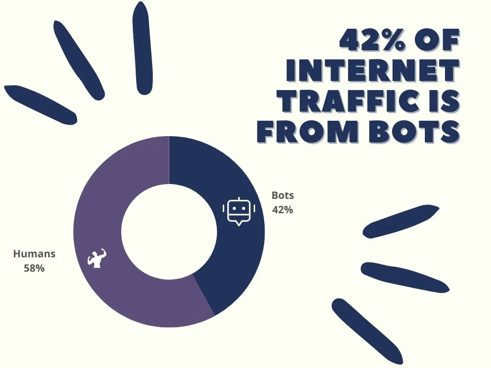
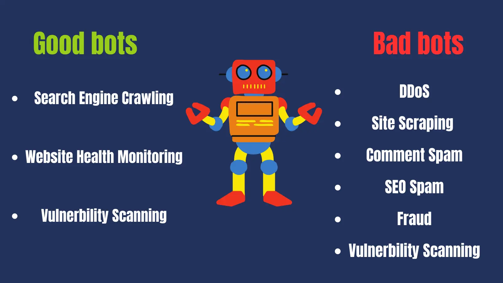

# Free Traffic Bot: Boost Your Website's SEO Ranking and Improve
              User Engagement (2023 Guide)

##### 
Share:[**](#)[**](#)[**](#)[**](#)
### Introduction

Do you want more people to visit your website without spending
              much money? Consider using a free traffic bot. These bots are a
              great way to quickly and easily increase your website's traffic
              and improve its ranking on search engines like Google. The best
              part is these bots won't cost you anything!

### Benefits Of Free Traffic Bots

Using a free traffic bot can benefit your website, such as
              improving your website's statistics like bounce rate, returning
              visitors, and time on page. While free traffic bots won't give you
              direct conversions, they can still help you rank higher on search
              engines, eventually leading to conversions. Additionally, using a
              free traffic bot can help you save money on paid advertising
              campaigns while still getting the traffic you need to increase
              your website's visibility.
### Difference Between Bot Traffic and Human Traffic

**Human Traffic**is created by real people who visit a website and interact with
              its content. This type of traffic is critical because it results
              in conversions, such as purchases or sign-ups.

**Bot Traffic**, on the other hand, is generated by automated programs that
              can't make direct conversions. However, bot traffic can still help
              increase website traffic, improve statistics, and rank higher on
              search engines, increasing your website's human traffic and
              resulting in indirect conversations.
## Best Free Traffic Bots

There are a variety of websites and services that offer free traffic
            bots, but it's important to exercise caution when using them. Some
            popular options are:

### #1 Traffic Bot

Traffic-Bot is a traffic generator providing paid and free
                    bot traffic. Choose website traffic from various locations
                    and sources and customize your traffic settings to meet your
                    needs.

<iframe width="560" height="315" src="https://www.youtube.com/embed/T81pSbwizLg" frameborder="0" allowfullscreen></iframe>

Traffic Types:[Website Traffic](#)[SEO Traffic](#)[Naver Traffic](#)[Google Search Console Traffic](#)[Google Maps Traffic](#)[DuckDuckGo](#)Design:

Pricing:

Support:

Traffic Quality:

Total Rating:

Links:[Website**](https://traffic-bot.com)[Pricing**](https://traffic-bot.com/pricing)

### #2 Traffic Creator

Traffic Creator is a well-known traffic generation tool that
                    offers unlimited bot traffic at no cost. This free bot
                    traffic originates from diverse global sources, making
                    direct traffic available for a lifetime.Traffic Types:[Website Traffic](#)[SEO Traffic](#)[Naver Traffic](#)[Google Search Console Traffic](#)[Google Maps Traffic](#)[DuckDuckGo](#)Design:

Pricing:

Support:

Traffic Quality:

Total Rating:

Links:[Website**](https://traffic-creator.com)[Pricing**](https://traffic-creator.com/pricing)

### #3 10kHits

10kHits is a traffic exchange service. They offer free
                    traffic exchange with other members and paid plans to
                    increase the traffic. The traffic may be low quality
                    comparing to competitors. There is no live chat for support.
                    You can submit a ticket and get a response within 24 hours.Traffic Types:[Website Traffic](#)Design:

Pricing:

Support:

Traffic Quality:

Total Rating:

Links:[Website**](https://www.10khits.com/)[Pricing**](https://www.10khits.com/pricing)
### Pros Of Free Traffic Bots

Benefits of using free bot traffic for websites.
- Free Bot Traffic
- Improve Website Statistics
- Improve Search Engine Ranking
- Website Testing
### Contra Of Free Traffic Bots

Problems of using free bot traffic for websites.
- Low Traffic Amount
- Lower Quality
- Not Targeted
- Not Adjustable
#### Tips for using free traffic bots effectively

If you decide to use free traffic bots, there are some tips to keep
            in mind to make the most of your efforts:

**Use reputable traffic bot services**to ensure the traffic is high-quality and safe for your website.

**Set realistic expectations**for the traffic you receive. Free traffic bots can deliver a
              different level of quality or targeting comparing to paid traffic.

**Monitor your website statistics**to determine the impact of the traffic on your site.**Don't rely on free traffic bots only**. Consider other strategies like content marketing, social media
            marketing, and paid advertising to diversify your traffic sources.
### Is Bot Traffic Harmful?

#### Explanation of the potential risks associated with using bot traffic

Bot traffic can be harmful if not used properly or if obtained from
            unreliable sources. Potential risks from using bot traffic include:

**Damage to SEO:**Search engines, such as Google, have algorithms that can detect
              and penalize websites that use bot traffic to inflate their web
              traffic. This can result in a significant decrease in website
              ranking and visibility, making it harder for potential customers
              to find your website.

**Damage to website reputation:**Using bot traffic to artificially inflate website statistics, such
              as bounce rate and time on page, can damage the reputation of your
              website. This can lead to a decrease in credibility and trust,
              which can ultimately harm your business.

**Security risks:**Traffic coming from malicious sources, such as bots used for
              hacking or phishing. These bots can help to hack your website and
              put your visitors' personal information at risk.
#### Discussion of ways to minimize the risks of using bot traffic

To minimize the risks of using bot traffic, it's important to:

**Use reliable sources:**only reputable sources of bot traffic, such as Traffic-Bot, that
              are known for providing high-quality bot traffic.

**Use bot traffic in moderation:**Use bot traffic sparingly and in moderation to avoid raising
              suspicion from search engines and damaging your website's
              reputation.

**Monitor website statistics:**Monitor website statistics regularly to ensure that bot traffic
              is not adversely affecting your website's performance. If you
              notice any anomalies or suspicious activity, take immediate action
              to investigate and correct the issue.

By following these guidelines, you can use bot traffic safely and
            effectively to improve your website's performance and increase your
            online visibility.
### How do you tell if a bot is crawling your site?

#### Common signs that a bot is crawling your site:

If you think a bot is crawling your website, check for these common
            symptoms:

**A sudden surge in traffic:**If you notice a sudden increase in traffic on your site, it's
              crucial to investigate the traffic source to confirm that it's
              legitimate. While more traffic can be beneficial, it's essential
              to ensure that it's not bad bots driving up the numbers.

**High bounce rates:**If you see that many visitors are leaving your site after viewing
              only one page, bots may be responsible. Bots tend to visit a
              single page before moving on to another site, which can result in
              a higher bounce rate than what human visitors exhibit.

**Suspicious or irrelevant referral traffic:**If you notice traffic coming from dubious or irrelevant sources,
              it could indicate that bots are crawling your site. For instance,
              if your website is about health, but you're receiving traffic from
              adult or gambling sites, the traffic is more likely coming from
              bots.
#### How to recognize website bot traffic and take steps to reduce its
            effects:

With the assistance of some online tools, you can determine the
            volume and th source of traffic to your website. The most used
            methods are:

**Google Analytics:**This free tool will provide you with information about the
              traffic, including the source.

**Bot Filtering:**Bot Filtering detects and blocks suspicious traffic automatically.
              Hosting services like WordPress sometimes have it as a feature.

**Tools from third parties:**SEMrush and Ahrefs, can assist you in identifying bot traffic by
              giving you details on the traffic sources and keywords that direct
              people to your website.

These tools allow you to identify bot traffic on your website and
            take action to decrease its negative effects.
### How much should you pay for bot traffic?

It's crucial to comprehend pricing and the variables that influence
            it when buying bot traffic. What you need to know is as regards:

Depending on the service provider and the volume of traffic you want
            to buy, the prices can vary significantly. Prices for a few thousand
            visitors can be as low as a dollar or as high as several hundred
            dollars.
#### What affects the price of bot traffic?

The volume of traffic, the caliber of the bots being used, and the
            targeting options are just a few of the variables that can have an
            impact at the cost of the traffic. The cost will increase as the
            traffic becomes more advanced.
#### How to find the best deals on bot traffic?

To get the best deals on bot traffic, consider shopping around and
            comparing prices from different service providers. Look for
            providers that offer high-quality bots and provide targeting options
            that align with your goals. Additionally, consider starting small
            with a test campaign to ensure the traffic is converting well before
            investing a larger budget.
### How to use bot traffic for search engine optimization?

Bot traffic can be a useful tool for search engine optimization
            (SEO). By driving more traffic to your website, you can improve your
            website's search engine ranking, as well as increase user engagement
            with your content.
#### Tips for optimizing your website

To optimize your website for search engines traffic, there are a few
            key things you can do:

****Ensure that your website is mobile-friendly and
                  responsive**, as many bots are designed to crawl mobile sites.

****Make sure your website's content is high-quality**, relevant, and engaging, as this can help encourage user
              interaction and sharing.

****Use internal linking**to help bots navigate your site and discover new pages.

****Ensure that your website's code is clean**and optimized for search engines, with proper use of headings, alt
              tags, and other on-page SEO elements.

****Regularly monitor your website's analytics**to track the impact of bot traffic on your site's performance and
              adjust your strategies accordingly.

By following these tips and incorporating bot traffic into your
            website optimization strategies, you can improve your website's
            search engine ranking, user engagement, and overall performance.
### How do you attract actual people to your website?

Although bot traffic can boost website traffic numbers, it's vital
            to concentrate on generating genuine, organic traffic. Here's how
            you can increase organic traffic on your website:

**Improve SEO:**Write good quality content with keywords to rank your website
              higher on SERPs.

**Social Media Activity:**Promote your website by interacting with your followers and
              sharing engaging content on social media.

**Email marketing:**Make a list of potential customers, then send them newsletters or
              promotional emails.

**Influencer marketing:**Collaborate with bloggers or other influencers to market your
              website or products is also a great choice to drive more traffic
              to your website.
### Traffic Bot Types

There are a few traffic bots, and each serves a different purpose.
- 
#### Increasing Website Traffic with Bots

These bots are made to drive traffic to websites, which
                    helps them rank better in search engine results pages
                    (SERPs).
- 
#### Bots for search engines

The purpose of these bots is to send clicks to search engine
                    result pages by mimicking human behavior, which will raise
                    your rankings.
- 
#### Social Media Bots:

These tools increase website traffic and gain likes, shares,
                    and followers on social media platforms.
- 
#### Spam content bots:

These bots are programmed to post spam posts and comments to
                    drive traffic and build backlinks.
- 
#### Malicious Bots:

These bots can pose a security risk to websites because they
                    are made to engage in harmful activities like hacking or
                    phishing.
### Conclusion

Using traffic bots can be a valuable way for website owners to boost
            their traffic and SEO rankings. However, taking precautions like
            selecting reliable providers, monitoring traffic patterns, and
            optimizing your website for both human visitors and bots is
            essential to minimize any risks involved.

Furthermore, it's crucial to integrate bot traffic with other
            techniques, such as content creation and social media marketing, to
            create a well-rounded approach to driving actual traffic to your
            website. By combining these strategies, you can develop an effective
            plan to bring more visitors to your website and ultimately help you
            achieve your goals.

We will continue to update[traffic-bot.com](https://traffic-bot.com); if you have any questions or suggestions, please contact us[Free Bot Traffic](#)[SERP Clicks](#)[Free Website Traffic](#)[Best Bot Traffic](#)